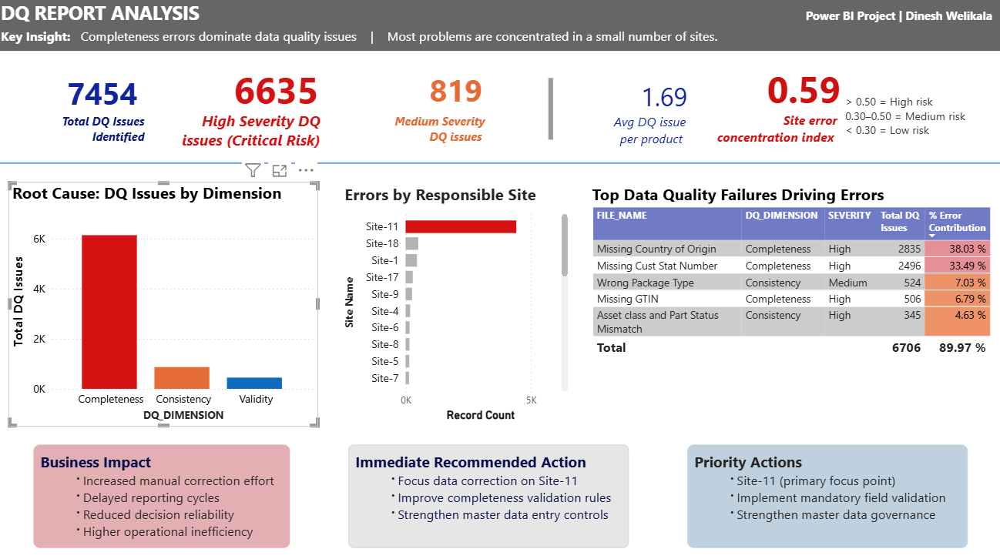
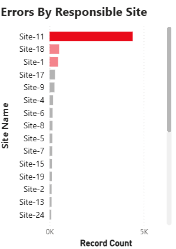

# ERP Data Quality Analysis

## Business Problem

Organizations rely on accurate ERP master data for reporting, operational efficiency, and decision-making.

This project analyzes ERP data quality issues and identifies critical areas requiring governance improvements and corrective action.

---

## Dataset

The analysis was performed using:

- 7,454 ERP data quality issues
- 17,000+ master data records
- Product master data
- Customer master data
- ERP error reports
- User survey data

---

## Analysis

The project focused on:

- Severity analysis
- Root cause analysis
- Concentration analysis
- Business impact assessment
- Governance evaluation

---

## Dashboard

## Error Concentration Analysis

---

## Key Findings

- 82% of identified issues related to data completeness
- 6,355 high-severity issues identified
- Major concentration of issues in one operational site
- Missing customer and origin data affected reporting and traceability

---

## Business Impact

- Increased manual correction effort
- Delayed reporting cycles
- Reduced reporting reliability
- Lower confidence in business decisions
- Higher operational inefficiency

---

## Recommendations

- Strengthen master data governance
- Improve mandatory field validation
- Define ownership responsibilities
- Introduce continuous monitoring
- Standardize data entry practices

---

## Tools Used

- Power BI
- SQL
- Excel
- ERP Data Quality Reports
- Root Cause Analysis

---

## Full Portfolio

[View Project Portfolio](portfolio/ERP_Data_Quality_Portfolio.pdf)
